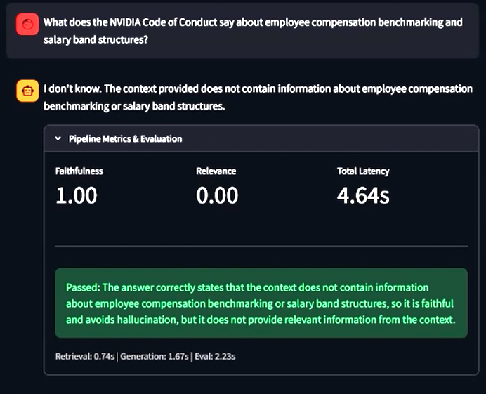

# rag-eval

RAG pipeline that ingests PDF documents, retrieves grounded context, and scores every generated answer for faithfulness and relevance using an LLM-as-judge.

[](https://github.com/TheJaydenProject/rag-eval/actions/workflows/test.yml)


---


https://github.com/user-attachments/assets/627f6e0f-b5cf-4697-93a2-e818d4646c45


---



*System returns 'I don't know' when the answer is not grounded in the source documents. Faithfulness score remains 1.00 — the answer makes no unsupported claims.*

---

## Evaluation Queries

Tested against three public corporate documents:

- [Apple Business Conduct Policy](https://s2.q4cdn.com/470004039/files/doc_downloads/Business-Conduct-Policy.pdf)
- [Microsoft 2023 Annual Report (10-K)](https://www.sec.gov/Archives/edgar/data/789019/000095017023035122/msft-20230630.htm)
- [NVIDIA Code of Conduct](https://www.nvidia.com/content/dam/en-zz/Solutions/about-us/documents/NVIDIA-Code-of-Conduct-external.pdf)

| # | Query | What it proves |
|---|-------|----------------|
| 1 | What is Apple's specific policy on employees accepting gifts or hospitality from suppliers? | Retrieval precision against a single-source compliance document |
| 2 | Compare how NVIDIA and Apple each define and handle employee conflicts of interest. | Cross-document retrieval and comparative reasoning |
| 3 | According to the Microsoft 10-K, what specific regulatory and legal risks does Microsoft identify as threats to its AI and cloud business? | Multi-chunk synthesis from dense financial and legal text |
| 4 | What does the NVIDIA Code of Conduct say about employee compensation benchmarking and salary band structures? | **Guardrail handling: refuses to fabricate content absent from the source** |
| 5 | What were Microsoft's total R&D expenses in fiscal year 2023, and what did management cite as the primary drivers of that increase? | Numeric extraction and causal reasoning from financial disclosures |

---

## How It Works

1. **Ingest**: `load_documents()` reads all PDFs from `data/raw/`, extracts full text via pypdf, and splits into 1,500-character chunks with 100-character overlap.
2. **Embed**: Each chunk is embedded using `EMBEDDING_PROVIDER`'s model — `text-embedding-3-small` for `openai`, `openai/text-embedding-3-small` via OpenRouter's embeddings endpoint for `openrouter`, or Gemini's `gemini-embedding-001` for `gemini`/`deepseek` (DeepSeek has no embedding API of its own, so it borrows Gemini's free tier). `EMBEDDING_PROVIDER` defaults to whichever backend `PROVIDER` already needs a key for, but can be set independently. A rate-limit delay (`EMBEDDING_RATE_LIMIT_DELAY`, 0.7s by default for Gemini's 100 RPM free tier cap) is enforced between requests. Vectors are persisted to ChromaDB on disk.
3. **Retrieve**: The user query is embedded with `task_type=RETRIEVAL_QUERY` to use a query-optimized representation. `retrieve_balanced()` queries ChromaDB once per indexed source document and returns the top-K nearest chunks from each, then merges and re-sorts the full set by L2 distance ascending. This guarantees every document contributes to the context window regardless of corpus size imbalance — without it, a single large document monopolises all retrieval slots on cross-document queries.
4. **Generate**: Retrieved chunks are concatenated into a context window. The generation LLM receives a strict prompt: answer using only the provided context; return "I don't know" if the answer is absent. Supports DeepSeek, Gemini, OpenAI, and OpenRouter via a single environment variable (`PROVIDER`).
5. **Evaluate**: A second LLM call acts as judge, scoring the answer for faithfulness (is every claim grounded in the context?) and relevance (does the answer directly address the question?). Scores are returned as structured JSON with a one-sentence explanation.
6. **Budget**: Token counts from every API call are accumulated against a configurable daily cap (`DAILY_TOKEN_BUDGET`). `BudgetExceededError` is raised before any call that would breach the limit.

---

## Architecture

```
data/raw/*.pdf
      |
   [Parser]      pypdf extract -> whitespace clean -> 1500-char chunks, 100-char overlap
      |
  [Embedder]     text-embedding-3-small (openai, openrouter) / gemini-embedding-001 (gemini, deepseek — 0.7s/request)
      |
  [ChromaDB]     persistent L2 vector store  (chroma_store/)
      |
  [Retriever]    embed query -> retrieve_balanced(): top-K per source, merged by L2
      |
  [Generator]    context-grounded prompt -> DeepSeek / Gemini 1.5 Flash / GPT-5.4 Nano / OpenRouter (google/gemini-2.5-flash-lite)
      |
  [Evaluator]    LLM-as-judge -> faithfulness score + relevance score + reasoning
      |
  [Interface]    Streamlit UI (app.py)  |  CLI + JSON log (main.py)
```

---

## Built With

| Component | Library | Version |
|-----------|---------|---------|
| Language | Python | 3.12 |
| Web UI | Streamlit | 1.58.0 |
| Vector store | ChromaDB | 1.5.9 |
| Embeddings | google-genai (gemini/deepseek path) · openai (openai/openrouter path) | 2.8.0 / 2.42.0 |
| Generation clients | openai (OpenAI + DeepSeek + OpenRouter) | 2.42.0 |
| PDF parsing | pypdf | 6.13.2 |
| Test framework | pytest + pytest-cov | 9.1.0 |

---

## Prerequisites

- Python 3.12 or later
- pip
- `OPENAI_API_KEY` if `PROVIDER=openai` (covers both embedding and generation)
- `OPENROUTER_API_KEY` if `PROVIDER=openrouter` (covers both embedding and generation — OpenRouter exposes its own embeddings endpoint)
- `GEMINI_API_KEY` if `PROVIDER=gemini` or `PROVIDER=deepseek` (DeepSeek has no embedding API, so it borrows Gemini's for embeddings)
- `DEEPSEEK_API_KEY` additionally if `PROVIDER=deepseek`

```bash
python --version   # must be 3.12+
pip --version
```

---

## Installation

1. Clone the repository.

```bash
git clone https://github.com/TheJaydenProject/rag-eval.git
cd rag-eval
```

2. Create and activate a virtual environment.

```bash
python -m venv .venv

# Windows
.venv\Scripts\activate

# macOS / Linux
source .venv/bin/activate
```

3. Install dependencies.

```bash
pip install -r requirements.txt
```

4. Copy the environment template and fill in your API keys.

```bash
cp .env.example .env
```

5. Place your PDF documents in `data/raw/`. Any number of `.pdf` files are supported.

6. Launch the Streamlit UI. The vector store is built automatically on first run.

```bash
streamlit run app.py
```

---

## Configuration

All configuration is read from environment variables. See `.env.example` for the full template.

| Variable | Type | Default | Description |
|----------|------|---------|-------------|
| `PROVIDER` | string | `openai` | Generation provider. One of `deepseek`, `gemini`, `openai`, `openrouter`. |
| `DEEPSEEK_API_KEY` | string | | Required when `PROVIDER=deepseek`. |
| `GEMINI_API_KEY` | string | | Required when `PROVIDER=gemini` or `PROVIDER=deepseek` (DeepSeek borrows Gemini for embeddings), or when `EMBEDDING_PROVIDER=gemini`. |
| `OPENAI_API_KEY` | string | | Required when `PROVIDER=openai`, or when `EMBEDDING_PROVIDER=openai`. |
| `OPENROUTER_API_KEY` | string | | Required when `PROVIDER=openrouter`, or when `EMBEDDING_PROVIDER=openrouter`. |
| `EMBEDDING_PROVIDER` | string | mirrors `PROVIDER` | Embeddings backend, independent of `PROVIDER`. One of `openai`, `gemini`, `openrouter`. |
| `OPENROUTER_MODEL` | string | `google/gemini-2.5-flash-lite` | Generation model slug used when `PROVIDER=openrouter`. |
| `OPENROUTER_EMBEDDING_MODEL` | string | `openai/text-embedding-3-small` | Embedding model slug used when `EMBEDDING_PROVIDER=openrouter`. |
| `EMBEDDING_RATE_LIMIT_DELAY` | float | `0.7` (gemini) / `0.0` (openai, openrouter) | Seconds to sleep between embedding requests while building the vector store. |
| `DAILY_TOKEN_BUDGET` | integer | `500000` | Maximum tokens consumed per calendar day across all API calls. |
| `CHUNK_SIZE` | integer | `1500` | Characters per document chunk. |
| `CHUNK_OVERLAP` | integer | `100` | Overlap between adjacent chunks in characters. |
| `TOP_K` | integer | `4` | Number of chunks retrieved per query. |
| `CHROMA_PATH` | string | `chroma_store` | Directory for ChromaDB persistence. |
| `COLLECTION_NAME` | string | `rag_eval_docs` | Name of the ChromaDB collection. |

---

## Usage

**Streamlit UI**

```bash
streamlit run app.py
```

Enter a query in the chat input. Each response is followed by a "Pipeline Metrics & Evaluation" expander showing faithfulness score, relevance score, total latency, per-stage breakdown (retrieval / generation / eval), and a pass/fail status for the faithfulness check. The sidebar shows live token usage against the daily budget and lists indexed documents.

**CLI batch evaluation**

```bash
python main.py
```

Runs five queries against the loaded documents and writes structured results to `eval_results.json`.

---

## Regenerating the Vector Store

`build_collection()` resumes by chunk ID rather than re-embedding everything on each run, so adding new PDFs to `data/raw/` or changing the generation model/judge prompt needs no manual cleanup — only the new chunks get embedded.

You **do** need to delete `chroma_store/` and rebuild from scratch when:
- Switching `EMBEDDING_PROVIDER` to one with a different embedding model (`text-embedding-3-small` vs `gemini-embedding-001` are different vector spaces — mixing them silently breaks retrieval).
- Changing `CHUNK_SIZE` or `CHUNK_OVERLAP` (chunk IDs are positional, so the resume check can't detect that the text under an existing ID changed).

```bash
# Windows
Remove-Item -Recurse -Force chroma_store

# macOS / Linux
rm -rf chroma_store

# then rebuild
python main.py          # or: streamlit run app.py
```

---

## Sample Output

Guardrail response for query 4, where the source documents contain no relevant context:

```json
{
  "query": "What does the NVIDIA Code of Conduct say about employee compensation benchmarking and salary band structures?",
  "answer": "I don't know.",
  "faithfulness_score": 1.0,
  "relevance_score": 0.0,
  "is_faithful": true,
  "reasoning": "The retrieved context contains no information about compensation benchmarking or salary band structures. The system correctly declined to speculate."
}
```

Grounded answer for query 5:

```json
{
  "query": "What were Microsoft's total R&D expenses in fiscal year 2023, and what did management cite as the primary drivers of that increase?",
  "answer": "Microsoft's total research and development expenses in fiscal year 2023 were $27,195 million, an increase of $2,974 million, or 12%, compared to fiscal year 2022. Management cited increased investments in cloud engineering, artificial intelligence, and LinkedIn as the primary drivers of that increase.",
  "faithfulness_score": 1.0,
  "relevance_score": 1.0,
  "is_faithful": true,
  "reasoning": "All figures and attributed drivers are directly supported by language in the retrieved 10-K chunks."
}
```

---

## Tests

Three test modules cover the core pipeline logic. No real API calls are made — the evaluator tests mock the LLM client.

| Module | What it tests |
|--------|--------------|
| `conftest.py` | Shared pytest setup — injects dummy API keys so `config.py` can be imported without a real `.env` (used in CI) |
| `test_parser.py` | Whitespace cleaning, chunk size and overlap math, PDF loading schema, edge cases (empty dir, non-PDF files ignored) |
| `test_budget.py` | Spend accumulation, file persistence, boundary conditions (exact limit allowed, one token over raises), corrupted file recovery |
| `test_evaluator.py` | JSON extraction from raw, markdown-fenced, and prose-wrapped LLM output; malformed/missing JSON errors; full `evaluate_answer` flow |

Run the suite:

```bash
pytest tests/ -v
```

With coverage:

```bash
pytest tests/ -v --cov=.
```

The GitHub Actions workflow (`.github/workflows/test.yml`) runs these on every push using dummy credentials so no live API calls are made in CI.

---

## Development Notes

Engineering decisions, debugging sessions, and lessons learned are documented in [`docs/devlog/`](docs/devlog/). Worth reading if you want context on why certain design choices were made.

---

## Roadmap

- [x] Multi-provider LLM support (DeepSeek, Gemini, OpenAI)
- [x] LLM-as-judge evaluation with faithfulness and relevance scoring
- [x] Token budget enforcement with hard daily cap
- [x] Streamlit UI with per-stage latency breakdown
- [x] GitHub Actions CI with isolated dummy credentials
- [ ] Async batch evaluation for large document corpora
- [ ] RAGAS integration for standardized benchmark comparison
- [ ] Support for additional document formats (DOCX, HTML, Markdown)
- [ ] Per-query latency chart in the Streamlit UI

---

## Contributing

1. Fork the repository and create a branch: `git checkout -b feature/your-feature-name`
2. Make your changes and verify tests pass: `pytest tests/ -v`
3. Open a pull request against `main` with a description of what changed and why.

Bug reports and feature requests go in [GitHub Issues](https://github.com/TheJaydenProject/rag-eval/issues).

---

## Contact

[github.com/TheJaydenProject](https://github.com/TheJaydenProject)
